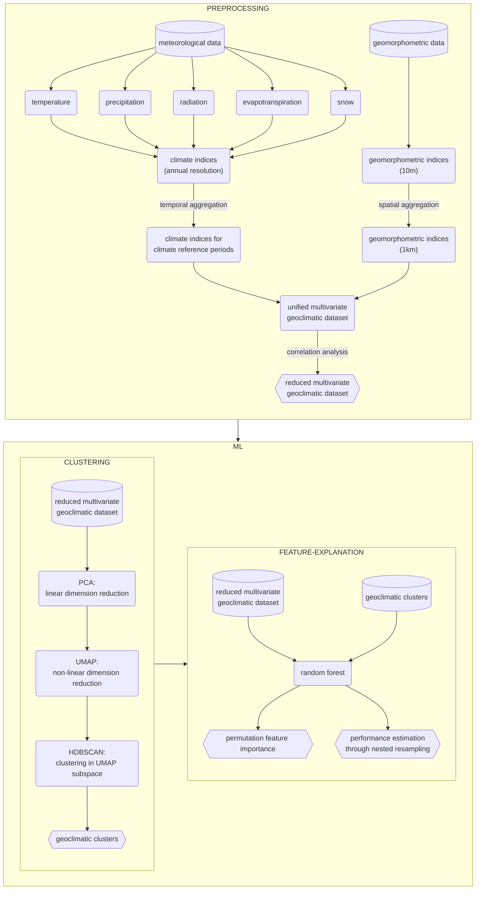

# Derivation of characteristic geoclimatic regions through density-based spatial clustering of high-dimensional data

<!-- badges: start -->
[](https://github.com/psf/black)
[](https://style.tidyverse.org/)
<!-- badges: end -->

This repository supplements the manuscript by
Sebastian Lehner <sup>[](https://orcid.org/0000-0002-7562-8172)</sup>,
Katharina Enigl <sup>[](https://orcid.org/0000-0002-3263-0918)</sup>,
and
Matthias Schlögl <sup>[](https://orcid.org/0000-0002-4357-523X)</sup>: **Derivation of characteristic geoclimatic regions through density-based spatial clustering of high-dimensional data**.

## Highlights

> - Geospatial clusters are derived from gridded climate and terrain data
> - Flexible nonparametric methods are used in a sequential workflow
> - Worfklow steps: dimensionality reduction, clustering, feature importance assessment
> - Effects of hyperparameter settings on the clustering result are discussed 
> - Validation is performed by means of nested resampling and synoptic plausibility

## Workflow



## Data

The following data sets have been used:
- SPARTACUS ([doi:10.1007/s00704-015-1411-4](https://doi.org/10.1007/s00704-015-1411-4), [doi:10.1007/s00704-017-2093-x](https://doi.org/10.1007/s00704-017-2093-x))
- WINFORE ([doi:10.5194/hess-20-1211-2016](https://doi.org/10.5194/hess-20-1211-2016))
- SNOWGRID ([doi:10.3390/atmos11121330](https://doi.org/10.3390/atmos11121330))
- a digital terrain model derived from airborne laser scanning (ALS-DTM)

All climate data sets are available through the [GeoSphere Austria Data Hub](https://data.hub.zamg.ac.at/).
The elevation data set is avaliable through the Austrian Open Government Data Platform
[data.gv.at](https://www.data.gv.at/katalog/dataset/land-ktn_digitales-gelandemodell-dgm-osterreich).

See [`doc/features.md`](./doc/features.md) for details on feature definition.

## Repo structure

This repo is loosely based on the *Cookiecutter Data Science*.

```sh
.
├── dat          # data sets
│   ├── interim  # interim data sets
│   ├── output   # final output
│   └── raw      # raw, immutable input data
├── dev          # scripts 
├── doc          # documentation
├── renv         # reproducible environments (R)
└── plt          # plots
```

## Reproducibility
- Python: Run `conda env create -f environment.yml` to create the conda-environment `subregion-derivation`.
- R: The R environment can be restored from the `renv.lock` using `renv::restore()`.
